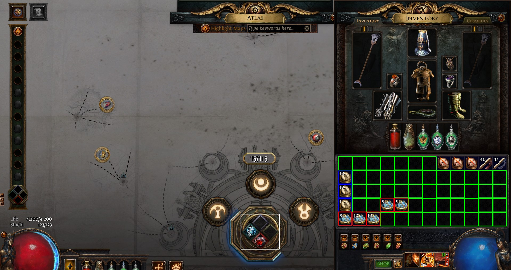

# ARPG Automation Tool
Uses opencv to identify game state then simulates input to automate rolling for desired modifiers.



## Info
Simple tool to help with automating sextant rolling for a popular ARPG. It gives the user a GUI with wihch they can configure the modifiers to search for and which voidstone to roll for. Once a desired modifier is found, the tool stores the modifier into a compass for use later. The tool uses opencv to detect game state and win32 api to send simulated inputs. The tool does not read the games memory. The tool currently only works for windows platforms as the simulated inputs and screenshots are done through the windows api.

### Features include
* Load custom modlist to use when rolling and storing modifiers. Use copy paste on a voidstone with the modifier you want to get exact wording.
* Select which voidstone gets rolled.
* Automatically handles inventory.
* Adjust the speed at which the bot simulates inputs. (Experimental)

## How to use

### Using prebuilt
 1. Download the build from the tag, run the executable. 
 2. If you have a custom modlist, then load that in using the GUI and select which voidstone you want to roll the modifiers on. 
 3. Once everything is set, Start the roller by pressing Cntrl+R or start on the GUI. Tab into the game and press numpad 0 to start. The bot will roll modifiers until it runs out of resources to roll with. User can manually stop by pressing and holding numpad 1.

### Building from source
* Requirement: ` CMake 3.16 or higher `

If you are using MSVC and have visual studio, simply open the source folder and ninja build configuration will automatically run cmake. If you do not have visual studio
then you will need to run cmake manually. 

```console
cmake -B./build/ -S. -DCMAKE_INSTALL_PREFIX=./build/bin
```

## Disclaimer
I do not condone breaking terms of service for any games. This is purely for educational purposes and for me to learn about opencv, and automation tools. Use it at your own risk as the developers may flag the executable's signature.
